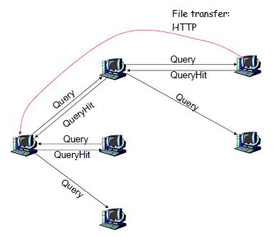

# Hierarchical Gnutella-P2P File Sharing System

#### GNUTELLA 
Protocol for distributed search based on decentralized Peer-to-Peer network. 

##### Architecture

### COMPONENTS:
#### Super Peer
The Super peer is based on socket implementation using threads. Each Super-peer acts as an Index Server which maintains the shared directory from the leaf nodes
*	REGISTER - Each client registers its directory path and client id to a super peer. 
*	SEARCH	- Each client searches a specified file at super peer.
*	QUERY	- Forward message from one to all, handle query hit 
*	QUERYHIT - 	Consists port of file owner and other information for direct connection for downloading the required file.

#### Lead Node
*	Register a list of files in directory.
*	User input to search for a file and method to download the requested file from the given client. 
* 	User can enforce to update file list for any changes in the shared dir.  

#### TradeOffs
1. Redundant communication in some cases. 
2. Degraded quality of service due to overloading and downloading failures if incomplete file is send.
